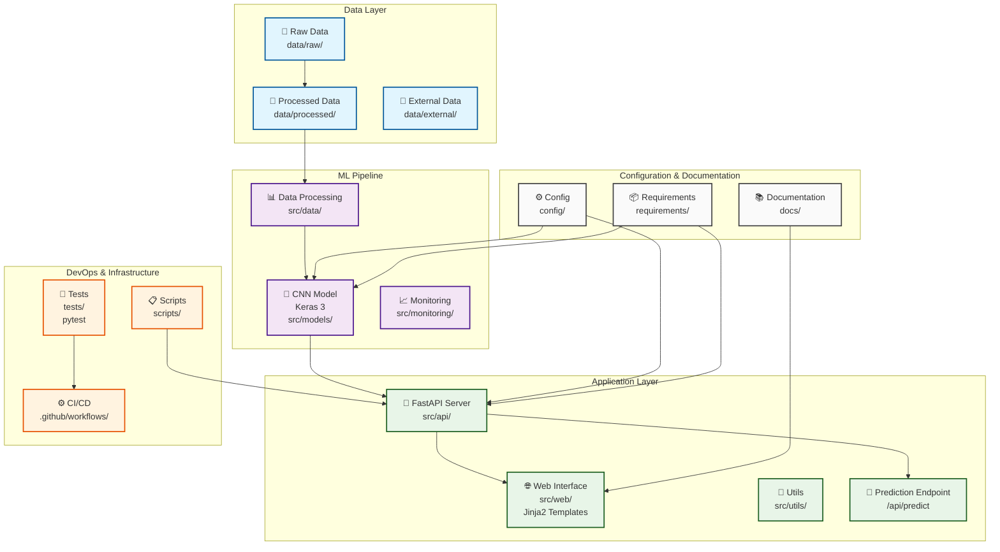

# Computer Vision - Classification d'images Cats & Dogs

[](https://www.python.org)
[](https://fastapi.tiangolo.com/)
[](https://keras.io/)
[](LICENSE)
[](CONTRIBUTING.md)

<div align="center">

<h3>Classification d'images avec Keras et exposition du modèle via Fast API</br></h3>

[Explore the docs](docs/)

</div>

---

## 📌 Introduction

Ce projet est à vocation pédagogique sur des thématiques IA et MLOps. Il permet de réaliser des tâches de Computer Vision et spécifiquement de la classification d'images par la reconnaissance de chats et de chiens.  
Il est composé de :

- Un modèle de computer vision développé avec Keras 3 selon une architecture CNN. Voir le tutoriel Keras ([lien](https://keras.io/examples/vision/image_classification_from_scratch/)).
- Un service API développé avec Fast API, qui permet notamment de réaliser les opérations d'inférence (i.e prédiction), sur la route `/api/predict`.
- Une application web minimaliste (templates Jinja2).
- Des tests automatisés minimalistes (pytest).
- Un pipeline CI/CD minimaliste (Github Action).

## 🏗️ Architecture de l'application



## 📁 Structure du projet

```txt
project-name/
├── .github/
│   ├── workflows/           # CI/CD pipelines
│   └── ISSUE_TEMPLATE/      # Templates d'issues
├── config/                  # Fichiers de configuration
├── data/
│   ├── raw/                 # Données brutes (gitignored)
│   ├── processed/           # Données traitées (gitignored)
│   └── external/            # Données externes/références
├── docker/                  # Dockerfiles et compose
├── docs/                    # Documentation
├── notebooks/               # Jupyter notebooks pour exploration
├── requirements/            # Dépendances par environnement
│   ├── base.txt
│   ├── dev.txt
│   └── prod.txt
├── scripts/                 # Scripts d'automatisation/déploiement
├── src/                     # Code source principal
│   ├── api/                 # APIs et services web
│   ├── data/                # Scripts de traitement des données
│   ├── models/              # Modèles ML/IA
│   ├── monitoring/          # Monitoring des modèles
│   ├── utils/               # Utilitaires partagés
│   └── web/                 # Templates jinja2
├── tests/                   # Tests unitaires et d'intégration
├── .env.example             # Variables d'environnement exemple
├── .gitignore
├── README.md
├── Makefile                 # Commandes fréquentes
└── pyproject.toml           # Configuration Python/packaging
```

## ⚙️ Configuration

### Variables d'environnement

Copiez le fichier `.env.example` vers `.env` et ajustez les valeurs selon vos besoins :

```bash
cp .env.example .env
```

#### Configuration SQLite

La base de données SQLite peut être configurée via ces variables d'environnement :

- `DATABASE_TYPE` : Type de base de données (défaut: `sqlite`)
- `DATABASE_PATH` : Chemin absolu vers le fichier `.db` (défaut: `feedbacks.db` dans le répertoire racine)
- `DATABASE_URL` : URL de connexion SQLAlchemy (défaut: `sqlite:///feedbacks.db`)

**Exemples de configuration :**

```bash
# Configuration par défaut (fichier dans le répertoire du projet)
DATABASE_PATH=/chemin/vers/votre/projet/feedbacks.db
DATABASE_URL=sqlite:////chemin/vers/votre/projet/feedbacks.db

# Configuration avec un répertoire dédié aux données
DATABASE_PATH=/var/data/cats_dogs/feedbacks.db
DATABASE_URL=sqlite:////var/data/cats_dogs/feedbacks.db

# Configuration Windows
DATABASE_PATH=C:\Users\username\Documents\data\feedbacks.db
DATABASE_URL=sqlite:///C:\Users\username\Documents\data\feedbacks.db
```

**Note :** Le fichier de base de données sera créé automatiquement s'il n'existe pas.

## 🛠️ Commandes utiles

*Section minimaliste à faire évoluer.*

```bash
make env           # Installer les dépendances dans un environnement virtuel
```

## 🎯 API

Lorsque l'environnement virtuel est activé, vous pouvez lancer le serveur de l'API ...

```bash
python scripts/run_api.py
```

... et visiter la page de documentation Swagger :


## 📊 Application web

Lorsque l'environnement virtuel est activé, vous pouvez lancer le serveur de l'API ...

```bash
python scripts/run_api.py
```

... et utiliser l'application web :


## 📊 Monitoring des Performances

L'application inclut un système de monitoring complet pour suivre les performances du modèle :

- **Temps d'inférence** : Mesure automatique du temps de traitement des images
- **Taux de succès** : Suivi des requêtes réussies/échouées
- **Feedback utilisateurs** : Collecte et analyse des retours utilisateurs
- **Précision du modèle** : Calcul du taux de précision basé sur les feedbacks

### Dashboard de Monitoring

Accédez au dashboard : `http://localhost:8000/monitoring`

Le dashboard affiche :
- Métriques en temps réel (actualisation automatique toutes les 30 secondes)
- Graphiques interactifs (répartition des prédictions, évolution des temps)
- Historique des requêtes récentes
- Statistiques de feedback utilisateurs
- Possibilité de filtrer par période (1h, 6h, 24h, 7j)

### API de Monitoring

Endpoint REST : `GET /api/monitoring?hours=24`

Retourne les métriques JSON complètes pour intégration externe.

### Métriques Collectées

**Inférence :**
- Nombre total de requêtes
- Taux de succès
- Temps d'inférence moyen/min/max
- Répartition des prédictions (Chat/Chien)
- Taille des fichiers traités

**Feedback :**
- Nombre total de feedbacks
- Taux de précision du modèle
- Feedbacks positifs/négatifs
- Historique des retours utilisateurs

## 📄 Licence

MIT - voir LICENSE pour plus de détails.
