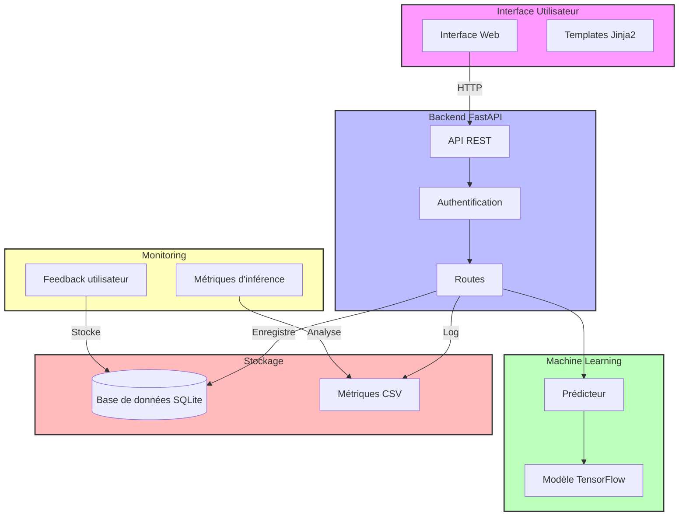

# Architecture du Projet Cats vs Dogs Classifier

## Vue d'ensemble

L'application est une solution complète de classification d'images utilisant le deep learning, avec une interface web et un système de feedback utilisateur. Voici les principaux composants :



## Structure des Dossiers

```
computer-vision-cats-and-dogs/
├── src/
│   ├── api/            # API FastAPI
│   ├── models/         # Modèles ML
│   ├── monitoring/     # Monitoring
│   └── web/           # Interface web
├── database/          # Base de données
├── tests/            # Tests automatisés
├── config/           # Configuration
└── docs/            # Documentation
```

## Flux de Données

1. **Soumission d'Image**
   - L'utilisateur soumet une image via l'interface web
   - L'API valide l'authentification et le format
   - Le prédicteur traite l'image
   - Le résultat est renvoyé à l'utilisateur

2. **Feedback Utilisateur**
   - L'utilisateur donne son feedback (correct/incorrect)
   - Le feedback est stocké dans la base SQLite
   - Les métriques sont mises à jour

3. **Monitoring**
   - Le temps d'inférence est enregistré
   - Les métriques de performance sont suivies
   - Les données de feedback sont analysées

## Technologies Utilisées

- **Frontend** : HTML, JavaScript, Bootstrap
- **Backend** : FastAPI, Python
- **ML** : TensorFlow, Keras
- **Base de données** : SQLite, SQLAlchemy
- **Monitoring** : CSV, Métriques personnalisées
- **Tests** : Pytest
- **CI/CD** : GitHub Actions

## Points de Sécurité

- Authentification par token
- Validation des entrées utilisateur
- Filtrage des types de fichiers
- Gestion des erreurs structurée

## Monitoring et Performance

- Temps d'inférence
- Taux de succès des prédictions
- Feedback utilisateur
- Métriques de performance du modèle