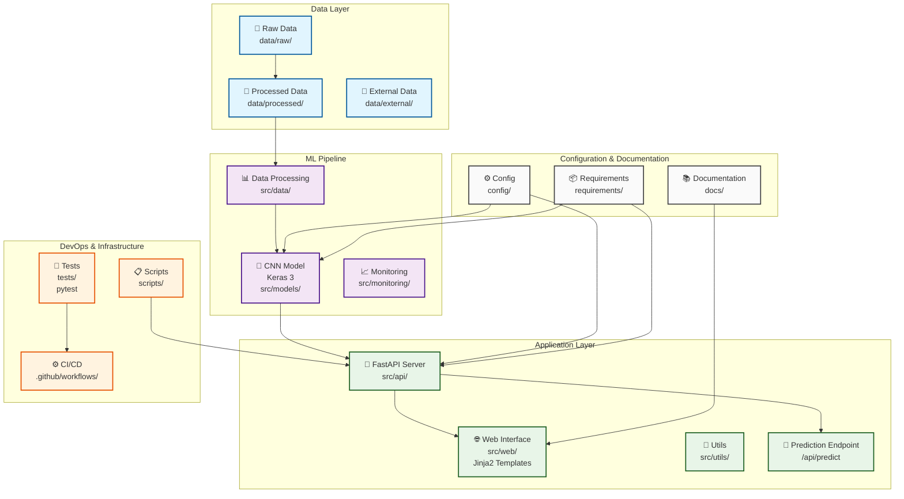

```mermaid
graph TB
    subgraph "Data Layer"
        A[📁 Raw Data<br/>data/raw/] --> B[📁 Processed Data<br/>data/processed/]
        C[📁 External Data<br/>data/external/]
    end
    
    subgraph "ML Pipeline"
        D[🧠 CNN Model<br/>Keras 3<br/>src/models/] 
        E[📊 Data Processing<br/>src/data/]
        F[📈 Monitoring<br/>src/monitoring/]
    end
    
    subgraph "Application Layer"
        G[🚀 FastAPI Server<br/>src/api/]
        H[🌐 Web Interface<br/>src/web/<br/>Jinja2 Templates]
        I[🔧 Utils<br/>src/utils/]
        R[🎯 Prediction Endpoint<br/>/api/predict]
    end
    
    subgraph "DevOps & Infrastructure"
        K[⚙️ CI/CD<br/>.github/workflows/]
        L[📋 Scripts<br/>scripts/]
        M[🧪 Tests<br/>tests/<br/>pytest]
    end
    
    subgraph "Configuration & Documentation"
        N[⚙️ Config<br/>config/]
        O[📚 Documentation<br/>docs/]
        Q[📦 Requirements<br/>requirements/]    
    end
    
    %% Data Flow
    B --> E
    E --> D
    D --> G
    G --> H
    G --> R
    
    %% API Routes
    %%G -.->|/api/predict| R[🎯 Prediction<br/>Endpoint]
    
    %% DevOps Integration
    M --> K
    L --> G
    
    %% Configuration
    N --> G
    N --> D
    Q --> G
    Q --> D
    
    %% Documentation & Development
    O --> H
    
    %% Styling
    classDef dataClass fill:#e1f5fe,stroke:#01579b,stroke-width:2px
    classDef mlClass fill:#f3e5f5,stroke:#4a148c,stroke-width:2px
    classDef appClass fill:#e8f5e8,stroke:#1b5e20,stroke-width:2px
    classDef devopsClass fill:#fff3e0,stroke:#e65100,stroke-width:2px
    classDef configClass fill:#fafafa,stroke:#424242,stroke-width:2px
    
    class A,B,C dataClass
    class D,E,F mlClass
    class G,H,I,R appClass
    class K,L,M devopsClass
    class N,O,Q configClass
```