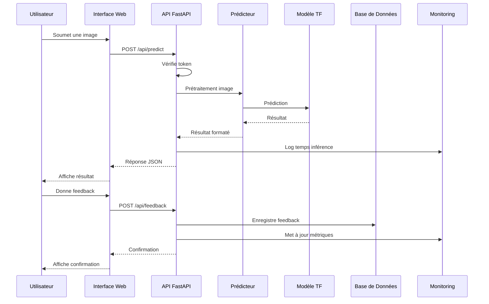

# Diagramme de Séquence - Prédiction et Feedback

```mermaid
sequenceDiagram
    participant U as Utilisateur
    participant W as Interface Web
    participant A as API FastAPI
    participant P as Prédicteur
    participant M as Modèle TF
    participant D as Base de Données
    participant Mo as Monitoring

    U->>W: Soumet une image
    W->>A: POST /api/predict
    A->>A: Vérifie token
    A->>P: Prétraitement image
    P->>M: Prédiction
    M-->>P: Résultat
    P-->>A: Résultat formaté
    A->>Mo: Log temps inférence
    A-->>W: Réponse JSON
    W-->>U: Affiche résultat

    U->>W: Donne feedback
    W->>A: POST /api/feedback
    A->>D: Enregistre feedback
    A->>Mo: Met à jour métriques
    A-->>W: Confirmation
    W-->>U: Affiche confirmation
```